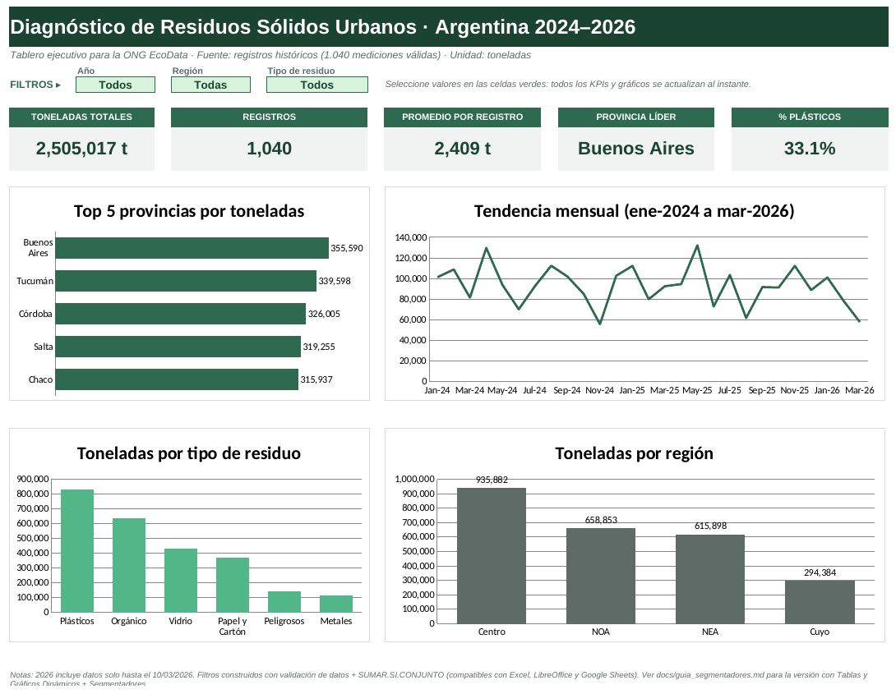

# ♻️ Diagnóstico de Residuos Sólidos Urbanos — EcoData

> **Proyecto de portafolio · Data Analyst** · Excel (ETL, estadística descriptiva, dashboard interactivo) + Data Storytelling



## 🎯 Problema de negocio
La ONG **EcoData** tenía una base histórica de mediciones de residuos urbanos (origen: registros del Ministerio de Ambiente) **sucia y sin procesar**. La generación de residuos crece, pero el presupuesto de reciclaje está estancado. La dirección necesitaba saber **dónde y qué tipo de residuo priorizar** para presentar propuestas a legisladores.

**Solución:** limpié 1.095 registros, calculé métricas descriptivas y construí un **dashboard interactivo en Excel** y un **reporte ejecutivo de 2 páginas** con recomendaciones basadas en datos.

## 📊 Resultados clave
| Indicador | Resultado |
|---|---|
| Volumen analizado | **2.505.017 t** en 1.040 mediciones válidas (ene-2024 → mar-2026) |
| Calidad de datos | 45 duplicados + 10 nulos aislados (5,0 %) · 86 provincias mal escritas corregidas |
| Concentración | Región **Centro = 37,4 %** del volumen · Buenos Aires lidera (14,2 %) |
| Residuo principal | **Plásticos = 33,1 %** del volumen y **+3,5 %** entre 2024 y 2025 |
| Mayor crecimiento | Vidrio **+8,8 %** · Región NEA **+8,9 %** (2025 vs 2024) |
| Dispersión | Media 2.408,67 t vs mediana 2.003,16 t · CV 69,9 % · 13 outliers (> media + 3σ) |

## 💡 Recomendaciones
1. Estrategia contra **plásticos de un solo uso** (1/3 del volumen y en crecimiento).
2. Priorizar inversión en reciclaje en la **región Centro** (Buenos Aires y Córdoba).
3. Circuitos de retorno de **vidrio** y previsión logística en el **NEA**.
4. Auditar los **13 registros atípicos** antes de dimensionar infraestructura.
5. Formularios con listas desplegables para **mejorar la calidad del dato en origen**.

📄 Informe completo: [`docs/reporte_ejecutivo_residuos.pdf`](docs/reporte_ejecutivo_residuos.pdf)

## 🛠️ Herramientas y técnicas
- **Microsoft Excel:** Tablas oficiales (`TablaResiduosLimpios`), referencias estructuradas, `SUMAR.SI.CONJUNTO`, `CONTAR.SI.CONJUNTO`, `BUSCARV`, `INDICE/COINCIDIR`, `K.ESIMO.MAYOR`, `SI` anidado, validación de datos, gráficos.
- **Estadística descriptiva:** media, mediana, moda, desviación estándar, percentiles, coeficiente de variación, z-score, detección de outliers.
- **Data Storytelling:** reporte ejecutivo orientado a tomadores de decisión.
- **Git & GitHub:** control de versiones y documentación.

## 🔄 Flujo de trabajo (ETL)
```text
[datos RAW .csv] ──> [Limpieza en Excel] ──> [Cálculos y tablas resumen] ──> [Dashboard + Reporte]
```
| Semana | Entregable |
|---|---|
| 1 · Adquisición y limpieza | Auditoría de anomalías, normalización de texto, tabla `TablaResiduosLimpios` → [`informe_limpieza.md`](docs/informe_limpieza.md) |
| 2 · Análisis descriptivo | Hoja `calculos_estadisticos`, columna `Categoria_Volumen`, tablas resumen (Top provincias, evolución, tipo) |
| 3 · Visualización y entrega | Hoja `dashboard` con 3 filtros (Año, Región, Tipo), reporte PDF y este repositorio |

## 🖱️ Cómo usar el dashboard
1. Descarga [`notebooks_reports/diagnostico_residuos_ecodata.xlsx`](notebooks_reports/diagnostico_residuos_ecodata.xlsx).
2. Abre la hoja **`dashboard`** y elige valores en las celdas verdes **Año**, **Región** y **Tipo de residuo**.
3. Los 5 KPIs y los 4 gráficos se recalculan al instante.

> Los filtros están hechos con validación de datos + `SUMAR.SI.CONJUNTO` para que funcionen en Excel, LibreOffice y Google Sheets. La variante con Tablas Dinámicas y Segmentadores está documentada en [`docs/guia_segmentadores.md`](docs/guia_segmentadores.md).

## 📁 Estructura del repositorio
```text
diagnostico-residuos-ecodata/
├── data/
│   ├── raw/                  # residuos_urbanos_raw.csv / .xlsx + anexo técnico (originales, nunca se modifican)
│   └── processed/            # datos_residuos_procesados.xlsx (TablaResiduosLimpios)
├── docs/
│   ├── reporte_ejecutivo_residuos.pdf / .docx
│   ├── informe_limpieza.md   # recuento de filas y decisiones de limpieza
│   ├── diccionario_datos.md  # columnas y glosario
│   ├── guia_segmentadores.md
│   └── img/dashboard.png
├── notebooks_reports/
│   └── diagnostico_residuos_ecodata.xlsx   # libro completo con dashboard
└── README.md
```

**Hojas del libro:** `portada` · `dashboard` · `tablas_dinamicas` · `calculos_estadisticos` · `datos_procesados` · `catalogo_provincias` · `anomalias` · `datos_raw`

## ⚠️ Limitaciones
- 2026 contiene datos solo hasta el 10/03/2026: no es comparable con años completos.
- Análisis descriptivo (sin inferencia ni modelos predictivos), según el alcance del MVP.
- Dataset de práctica provisto por Talently Lab (*Guía de proyectos para Data Analyst*).

## 👤 Autor
**Jeisson Marin Uribe Luis** — Data Analyst · Estudiante de Ingeniería de Sistemas e Ingeniería Industrial · Scrum Master · Six Sigma Yellow Belt · Power BI & Excel
🐙 [github.com/ujeisson-alt](https://github.com/ujeisson-alt)
